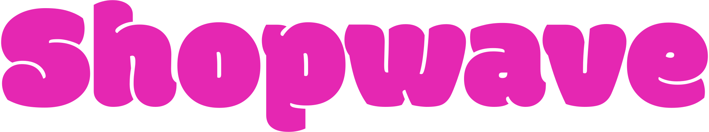

<div align="center"><a href="https://github.com/devbytemehedi/shopwave.git"></a>
 <h4><strong>A Simple Responsive & Interactive E-Commerce Website </strong></h4>
<a href="https://dub.sh/shopwave"></a></div>

## How to run this ?

1. **Clone** this **repository**

```bash
git clone https://github.com/devbytemehedi/shopwave.git
```

2. Open **shopwave** in **vscode**

```pwsh
code shopwave
```

3. Install **node modules** assuming you have `node.js` **installed** on your machine.

```bash
npm i
```

4. Prepare `code` for **deployment**

```bash
npm run build
```

5. Install **Live Server** Extension
6. Open `src/main.html` and Right click on the editor
7. Click **"Open with Live Server"**.
8. **Project** should be up and running in your **browser**.


## License

The code is available under the [MIT](./LICENSE) license.

## Acknowledgements

 [Logo](https://logo.com/) - [Montserrat](https://fonts.google.com/specimen/Montserrat) - [SwiftStart](https://github.com/devbytemehedi/swiftstart)

